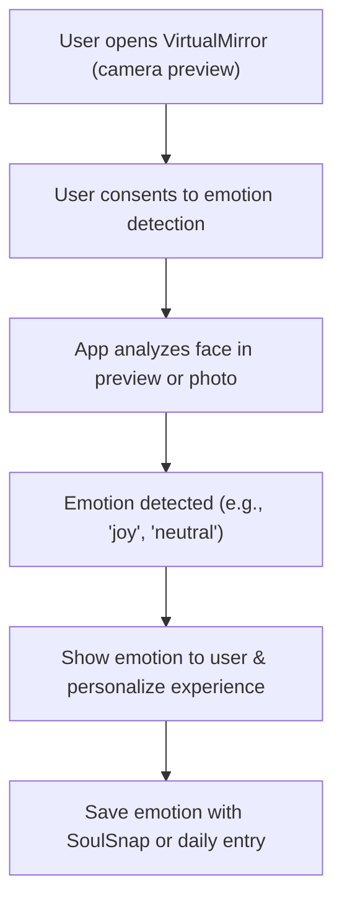

Great question! Here’s how real emotion detection relates to your VirtualMirror feature, especially where you have a camera preview:

---

## VirtualMirror + Emotion Detection: How They Connect

### 1. **VirtualMirror as an Emotion Input Source**
- The VirtualMirror feature, with its camera preview, can be used to capture the user's face in real time.
- You can analyze the live camera feed or a captured photo to detect the user's current emotion using facial expression analysis.

### 2. **User Experience Flow**
- User opens VirtualMirror (sees themselves in the camera preview).
- Optionally, the app prompts: “How are you feeling? Let’s find out together!”
- The app can:
  - **A.** Passively analyze the live preview (with consent) and display a detected emotion (e.g., “You look happy!”).
  - **B.** Ask the user to take a selfie, then analyze that image for emotion.
- The detected emotion can be:
  - Shown to the user as feedback.
  - Used to personalize affirmations, journal prompts, or map pins.
  - Saved as part of a SoulSnap or daily mood entry.

### 3. **Why This Is Powerful**
- **Objective Input:** Not all users can or want to label their emotions in words. Facial analysis provides an objective, automatic suggestion.
- **Engagement:** Seeing real-time feedback (“You look calm today!”) can make the VirtualMirror more interactive and fun.
- **Personalization:** Detected emotions can drive personalized content (affirmations, reflections, etc.) and analytics.

### 4. **Technical Integration**
- When the camera preview is active, you can:
  - Use a face detection/emotion recognition library (on-device or via API).
  - Analyze frames in real time or on-demand (when the user taps a button).
  - Display the detected emotion as an overlay or in the UI.
- Example libraries/APIs:
  - **Android:** ML Kit Face Detection, OpenCV, DeepFace (with JNI), or cloud APIs.
  - **iOS:** Vision framework, CoreML, or cloud APIs.
  - **KMP:** You’d likely need to use platform-specific code for the actual detection, but can unify the logic in shared code.

### 5. **Privacy & Consent**
- Always ask for explicit user consent before analyzing camera data.
- Let users opt out or manually select their emotion if they prefer.

---

## Example Flow Diagram



---

## Summary

- **VirtualMirror** is a perfect place to implement real-time or on-demand emotion detection using the camera.
- This feature can make emotion tracking more automatic, engaging, and accurate.
- The detected emotion can be used throughout your app: for journaling, affirmations, analytics, and more.

If you want, I can provide a technical outline or code sample for integrating facial emotion detection into your VirtualMirror feature. Just let me know your target platform(s) and privacy requirements!

To implement real emotion detection in your SoulSnaps MVP, you have a few main options, each with different levels of complexity and accuracy. Here’s a breakdown of the most common approaches and how you might integrate them:

---

### 1. **Text-Based Emotion Detection (NLP)**
- **How it works:** Analyze the user's written description (text) of their moment/SoulSnap using Natural Language Processing (NLP) to infer emotion.
- **How to do it:**
  - Use a pre-trained sentiment/emotion analysis model (e.g., HuggingFace Transformers, Google Cloud Natural Language API, or OpenAI GPT).
  - When a user adds a description, send the text to the model/API and get back an emotion label (e.g., happy, sad, angry, etc.).
- **Pros:** Easy to implement, works on-device or via cloud, no privacy issues with images/audio.
- **Cons:** Only works if users write meaningful descriptions.

---

### 2. **Image-Based Emotion Detection (Facial Expression Analysis)**
- **How it works:** Analyze photos (selfies or portraits) to detect emotions from facial expressions.
- **How to do it:**
  - Use a pre-trained model or API (e.g., Microsoft Azure Face API, AWS Rekognition, Google Cloud Vision, or open-source models like DeepFace).
  - When a user adds a photo, process the image to detect faces and infer emotions.
- **Pros:** Can work even if the user doesn’t write much.
- **Cons:** Privacy concerns, requires user consent, may not work well with non-face images.

---

### 3. **Voice-Based Emotion Detection**
- **How it works:** Analyze the user's voice (if they record audio) to detect emotional tone.
- **How to do it:**
  - Use APIs like IBM Watson Tone Analyzer, Microsoft Azure Speech, or open-source models for speech emotion recognition.
  - When a user records audio, process the file to extract emotion.
- **Pros:** Adds a new dimension, can be combined with text/image.
- **Cons:** Requires users to record audio, privacy concerns.

---

### 4. **Multimodal Emotion Detection**
- **How it works:** Combine text, image, and audio for more accurate emotion detection.
- **How to do it:**
  - Use or build a model that takes all available inputs and fuses the results (e.g., ensemble of text, image, and audio models).
- **Pros:** Most accurate, robust to missing data.
- **Cons:** Most complex to implement.

---

## How to Integrate in Your MVP

- **Start simple:** For MVP, text-based detection is easiest and most privacy-friendly.
- **Sample workflow:**
  1. User adds a SoulSnap with a description and/or photo.
  2. On save, send the description to an emotion analysis API (or run a local model).
  3. Optionally, if a face is detected in the photo, run image-based emotion detection.
  4. Store the detected emotion with the SoulSnap entry.
  5. Use the detected emotion to personalize affirmations, map pins, etc.

---

## Example: Using HuggingFace for Text Emotion Detection (Kotlin/Compose)

You can call a cloud function or backend API that uses HuggingFace’s emotion models, or use a cloud NLP API directly.

**Sample API call (pseudo-code):**
```kotlin
val response = httpClient.post("https://api-inference.huggingface.co/models/j-hartmann/emotion-english-distilroberta-base") {
    header("Authorization", "Bearer YOUR_HF_API_KEY")
    setBody("""{"inputs": "I feel so happy today!"}""")
}
val emotion = response["label"] // e.g., "joy"
```

---

## Privacy & UX Considerations

- Always ask for user consent before analyzing images or audio.
- Let users override or correct the detected emotion.
- Be transparent about how data is processed and stored.

---

## Next Steps

- Would you like a code example for a specific platform (Android/iOS/KMP)?
- Do you want to use only text, or also image/audio?
- Should the detection run on-device or via a cloud API?

Let me know your preferences, and I can provide a concrete implementation plan or code sample!